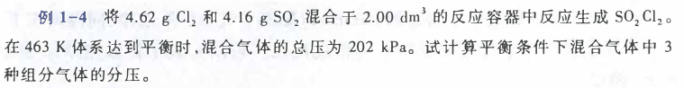
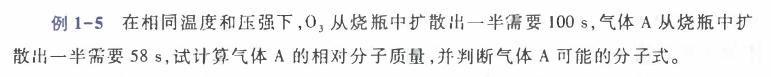

# 现代化学发展的新趋势
* 从宏观向微观深入
* 从定性和半定量到定量
* 对物质的研究从静态向动态发展
* 从经验合成向定向设计转化

# 理想气体的状态方程
## 理想气体
忽略分子自身体积，将分子看成是具有质量的几何点，分子之间没有相互碰撞和排斥，分子之间和分子和器毕之间的碰撞是完全弹性的，没有能量损失。
## 波义耳定律
当气体物质的量 $n$ 和温度 $T$ 一定时，体积和压强呈反比。 $V\propto \frac1p$
## 盖-吕萨克定律
但 $n$ 和 $p$ 一定时， $V\propto T$
## 阿伏伽德罗定律
当 $p$ 和 $T$ 一定时， $V\propto n$
## 理想气体的状态方程
$$ V = \frac{nRT}{p}\qquad\Longrightarrow\qquad pV=nRT$$

摩尔气体常数 $R=8.314J\cdot mol^{-1}\cdot K^{-1}$
## 范德华方程
实际气体体积中的理想空间： $V=V_R-nb$  
$b$:每摩尔气体分子的体积。 $n$:物质的量
> 实际气体分子：由于存在分子间的引力，所以对器壁的实际压强小于理想气体。

$p_{\text{理}}=p_{\text{实}}+p_{\text{内}}$  
$p_{\text{内}}$为由于分子间引力而减小的压强。

$p_{\text{内}}\propto(\frac{n_{\text{外}}}{V})(\frac{n_{\text{内}}}{V})$ 对于统一容器的器壁而言，两部分浓度相同。

所以， $p_{\text{内}}\propto(\frac{n}{V})^2$ $\Longrightarrow$ $p_{\text{内}}=a(\frac{n}{V})^2$

将理想空间公式和p内带入理想气体物态方程， $[p_{\text{实}}+(\frac{n}{V})^2](V_{\text{实}}-b)=nRT\qquad a,b是范德华常数$

当 $n=1mol$ 时, $(p_{\text{m,实}}+\frac{a}{V^2})(V_{\text{m,实}})=RT$

$He$ 接近理想气体。

# 1.1.2 混合气体的分压定律（道尔顿分压定律）

